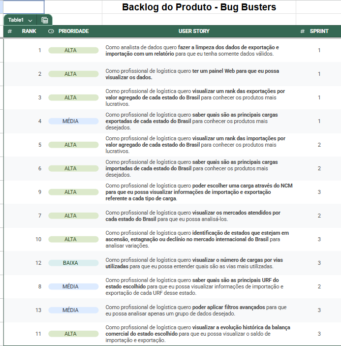

# AlfaLog

Projeto de API - 3° Semestre (2025) da Fatec São José dos Campos - BUG BUSTERS

O objetivo deste projeto é desenvolver uma plataforma web que disponibilize informações sobre o
desempenho  dos  Estados  Brasileiros  no  comércio  exterior, com  base  nos  dados  abertos  do
Ministério  do  Desenvolvimento,  Indústria,  Comércio  e  Serviços.  Essa  ferramenta  fornecerá  aos
tomadores  de  decisão  dados  claros  e  acessíveis,  permitindo  a  identificação  de  municípios  que
estejam em ascensão, estagnação ou declínio no mercado internacional.

| Cliente          | Periodo/Curso                                  | Professor M2     | Professor P2     | Contato Cliente                    |
| ---------------- | ---------------------------------------------- | ---------------- | ---------------- | ---------------------------------- |
| Prof Marcus Nascimento  | 3º ADS (Análise e Desenvolvimento de Sistemas) | Claudio Lima | Fernando Masanori  | <nascimento.mv@fatec.sp.gov.br> |

## Índice

- [AlfaLog](#alfalog)
  - [Índice](#índice)
  - [Cronograma e Sprints](#cronograma-e-sprints)
  - [Tratamento dos Dados do Comércio Exterior](#tratamento-dos-dados-do-comércio-exterior)
    - [Sprint 1](#sprint-1)
    - [Sprint 2](#sprint-2)
    - [Sprint 3](#sprint-3)
  - [Competências desenvolvidas](#competências-desenvolvidas)
    - [Hard Skills](#hard-skills)
    - [Soft Skills](#soft-skills)
  - [Tecnologias Utilizadas](#tecnologias-utilizadas)
  - [Documentos](#documentos)
    - [Backlog do Produto](#backlog-do-produto)
  - [Sprint 1](#sprint-1-1)
    - [Gráfico Burndown](#gráfico-burndown)
    - [Backlog da Sprint](#backlog-da-sprint)
  - [Sprint 2](#sprint-2-1)
    - [Gráfico Burndown](#gráfico-burndown-1)
    - [Backlog da Sprint](#backlog-da-sprint-1)
  - [Sprint 3](#sprint-3-1)
    - [Gráfico Burndown](#gráfico-burndown-2)
    - [Backlog da Sprint](#backlog-da-sprint-2)
  - [Autores](#autores)

## Cronograma e Sprints

| Sprint            | Previsão   | Status    |
| ----------------- | ---------- | --------- |
| Kick Off          | 28/02/2025 | Concluído |
| 01                | 31/03/2025 | Concluído |
| 02                | 28/04/2025 | Concluído |
| 03                | 05/05/2025 | Concluído |
| Feira de Soluções | 29/05/2025 | A fazer   |

## Tratamento dos Dados do Comércio Exterior

- A Leitura e a Limpeza dos Dados de Exportação e Importação dos Estados Brasileiros pode ser acesso [neste Jupyter notebook](./tratamento-dados/Tratamento%20dos%20Dados%20de%20Exportação%20e%20Importação%20dos%20Estados%20Brasileiros.ipynb).

### Sprint 1

- [x] Interface intuitiva
- [x] Mostra de dados

### Sprint 2

- [x] Dados reais mostrados em gráficos e tabela, com foco em gráfico
- [x] Maior densidade de informação

### Sprint 3

- [X] Cards com dados na página Dashboard
- [X] Página de pesquisa por NCM
- [X] Filtros específicos para pesquisa
- [X] Previsão de tendências

## Competências desenvolvidas

### Hard Skills

Hard skills desenvolvidas

- Habilidades analíticas;
- Linguagens e Frameworks
  - React
  - JavaScript
  - TypeScript
  - Python
  - MySQL
  - Flask
  - HTML, CSS
- Conhecimento em ferramentas;
  - Jira
  - Git e GitHub
- Gestão de projetos;
- Competências técnicas;

### Soft Skills

Soft skills desenvolvidas

- Resolução de conflitos;
- Adaptabilidade;
- Comunicação;
- Autonomia
- Trabalho em equipe.

## Tecnologias Utilizadas

<!--  -->

- Git e GitHub
- Python
- JavaScript
- TypeScript
- React
- HTML, CSS
- Jira
- MySQL
- Markdown
- Flask
- Google Colab
- Vite
- Tailwind
- ApexChart
- Docker
- Prophet
- AWS

## Documentos

### Backlog do Produto

## Sprint 1

### Gráfico Burndown

### Backlog da Sprint

## Sprint 2

### Gráfico Burndown

### Backlog da Sprint

## Sprint 3

### Gráfico Burndown

### Backlog da Sprint

<!-- ## Veja Também

[Como Contribuir](./CONTRIBUTING.md) para você que quer contribuir no desenvolvimento desse projeto.

[Manual do Usuário](./docs/manual.md) para você que quer entender como utilizar o nosso site. -->

## Autores

|    Função     | Nome             |                                                                                                                                               GitHub |
| :-----------: | :--------------- | ---------------------------------------------------------------------------------------------------------------------------------------------------: |
|  Product Owner  | Wesley Gonçalves |       |
|  Scrum Master  | Davi Miyake      |             |
| Team Member | Gabriel Viell    |  |
| Team Member  | Vinicius Elias   |             |
|  Team Member  | Allan Couto      |            |
|  Team Member  | Diego Castilho   |              |
|  Team Member  | Humberto Ishii   |         |

